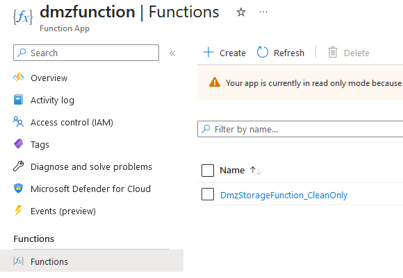

# DMZ Storage Account with Defender for Storage

Defender for Storage's Malware Scanning feature secures storage accounts by scanning uploaded blobs in near real time to identity malicious content. This solution leverages Defender for Storage Malware Scanning, Event Grid Custom Topics, and Azure Functions, to automate data movement from a DMZ Storage Account to Clean and Quarantine Storage Accounts.

# Overview


A publicly accessible DMZ Storage Account is the initial landing zone, or target, for blob uploads. Defender for Storage is enabled on the DMZ Storage Account allowing Malware Scanning to scan all uploaded or modified blobs. When the scan is complete, Defender writes the scan results to a blob index tag on each individual blob. The result can either be `Malicious` or `No threats found`.

Defender for Storage settings are used to stream the scan results to a custom Event Grid Topic. A Function App subscribes to the Event Grid, receives the scan results, and runs the [C# sample code](function_code.cs) which reads the scan result and moves the blob to the appropriate Storage Account (Clean or Quarantine) that is secured behind Private Endpoints.

# Deployment

## Table of contents

- [Deploy Resources](#deploy-resources)
  - [Storage Accounts](#storage-accounts)
  - [Event Grid Custom Topic](#event-grid-custom-topic)
  - [Function App](#function-app)
- [Permissions](#permissions)
- [Enable and Configure Defender for Storage](#enable-and-configure-defender-for-storage)
  - [Subscription Level](#subscription-level)
  - [Resource Level](#resource-level)
  - [Configure scan result event streaming](#configure-scan-result-event-streaming)
- [Deploy Code to Function App](#deploy-code-to-function-app)
- [Configure Event Subscription](#configure-event-subscription)
- [Validation](#validation)

## Deploy Resources

### Storage Accounts

This solution uses three storage accounts:

- DMZ Storage Account - Initial landing zone for blobs. Publicly accessible.
- Clean Storage Account - Blobs that are found to not have malware are moved here.
- Quarantine Storage Account - Blobs that are found to be malicious are moved here.

[How to Create a Storage Account](https://learn.microsoft.com/en-us/azure/storage/common/storage-account-create?tabs=azure-portal)

For enhanced security, limit public access to the Clean and Quarantine Storage Accounts using [Storage Account Network Settings](https://learn.microsoft.com/en-us/azure/storage/common/storage-network-security?tabs=azure-portal). Ideally, the Clean storage account will not be publicly accessible but instead leverage [Private Endpoint](https://learn.microsoft.com/en-us/azure/storage/common/storage-private-endpoints) to limit the exposure of scanned clean blobs. Using Private Endpoints with Storage impacts the Function App connectivity. See [Function App Deployment](#function-app) for more details.

Notes:

- Keep in mind the Defender for Storage [limitations for storage accounts](https://learn.microsoft.com/en-us/azure/defender-for-cloud/defender-for-storage-malware-scan#limitations).
- Deploy all Storage Accounts to the same region to improve copy performance.

### Event Grid Custom Topic

When Defender for Storage is enabled on a Storage Account, an Event Grid System Topic is automatically created to facilitate the Malware Scanning process. Removing this Event Grid System Topic will break Malware Scanning functionality. This System Topic also cannot be used for the purpose of this solution, as the `Microsoft.Security.MalwareScanningResult` Event Type is not available as a System Topic. Therefore, an Event Grid Custom Topic is required.

Follow this [how-to deployment guide](https://learn.microsoft.com/en-us/azure/event-grid/custom-event-quickstart-portal#create-a-custom-topic)

- Only create the Event Grid at this point, no need to create a message endpoint or subscription yet.
- Deploy to the same Region as the Storage Accounts

### Function App

Create a Function App in the same resource group as the DMZ Storage Account. When deploying, specify the *Azure Event Grid trigger* template. The provided sample c# code used .NET 6.

Resources:

- [Develop Azure Functions by using Visual Studio Code](https://learn.microsoft.com/en-us/azure/azure-functions/functions-develop-vs-code?tabs=csharp)
- [Use a function as an event handler for Event Grid events](https://learn.microsoft.com/en-us/azure/event-grid/handler-functions)

If public access to the Storage Account is blocked with the Storage Account Firewall, additional steps need to be taken to allow the Function App to access the Storage Account. There are a few options:

1. If using Private Endpoints with the Storage Account, [Enable Virtual Network Integration](https://learn.microsoft.com/en-us/azure/azure-functions/functions-networking-options?tabs=azure-cli#virtual-network-integration) on the Function App. After integrating the Function App into the VNet where the Private Endpoints are deployed, it will leverage the VNet's DNS settings and linked Private DNS Zones to resolve the Storage Accounts to their Private Endpoints. This requires a Premium App Service Plan. 
3. If using VNet whitelisting on the Storage Account Firewall, [Enable Virtual Network Integration](https://learn.microsoft.com/en-us/azure/azure-functions/functions-networking-options?tabs=azure-cli#virtual-network-integration) on the Function App. Add the Function Apps VNet/Subnet to the Storage Account VNet whitelist.
2. If using IP whitelisting on the Storage Account Firewall, [locate the Function App public IPs](https://learn.microsoft.com/en-us/azure/azure-functions/ip-addresses?tabs=portal#find-outbound-ip-addresses) and add them to the whitelist.

## Permissions

The Function App needs permissions on all Storage Accounts to carry out the blob move operations. The `Storage Blob Data Contributor` built-in role has all the necessary permissions.

Its easiest to assign permissions using a System Assigned Managed Identity on the Function App.

1. On the Function App, navigate to **Identity** in the side menu. Set status to **On**, then **Save**.
2. Select **Add Role Assignment** and add the `Storage Blob Data Contributor` for each storage account. Alternatively, add the role at the Resource Group or Subscription level.


## Enable and Configure Defender for Storage

Defender for Storage is enabled from either of two locations:

- Subscription level using the Defender for Cloud interface
- Resource level at each individual Storage Account

This solution only requires Defender for Storage to be enabled on the DMZ Storage Account where the blobs will be scanned. Clean and Quarantine Storage Accounts will only receive blobs that have been scanned in DMZ, so Defender for Storage Malware Scanning is not required there. The resource level enablement process was followed for this solution guide, however, both options are shown for completeness.

Ensure the Microsoft.EventGrid resource provider is registered on the Storage Account subscription. Use this PowerShell command to register the provider.

```PowerShell
Set-AzContext -Subscription "xxxx-xxxx-xxxx-xxxx"
Register-AzResourceProvider -ProviderNamespace Microsoft.EventGrid
```

### Subscription level

To enable Defender for Storage on all Storage Accounts within a subscription, navigate to **Defender for Cloud** -> **Environment Settings** -> **select the subscription**. Toggle **Storage** to **On** and click **Save**. In the Storage settings, you can optionally set a max limit on quantity of data scanned to put a cap on scanning costs.

After saving, it takes some time to onboard all Storage Accounts to Defender for Storage. To check the progress, navigate to each **Storage Account resource** -> **Microsoft Defender for Cloud** to see a status of either **Provisioning** or **On**.

[Additional Resources](https://learn.microsoft.com/en-us/azure/storage/common/azure-defender-storage-configure?toc=%2Fazure%2Fdefender-for-cloud%2Ftoc.json&tabs=enable-subscription)


### Resource level

To enable Defender for Storage on a specific Storage Account, navigate to the **Storage Account** and select **Microsoft Defender for Cloud** in the side bar. Ensure **On-upload malware scanning** is checked, then select **Enable on storage account**. It takes some time for the enablement to complete.


### Configure scan result event streaming

When Defender for Storage enablement is complete, navigate to the **Storage Account** and select **Microsoft Defender for Cloud** in the side bar. Select **Settings**, toggle **Override Defender for Storage subscription-level settings** to **On**. Check **Send scan results to Event-Grid topic** and select your Event Grid Custom Topic from the dropdown.


## Deploy Code to Function App

Edit the Function App code to use the [C# sample code](function_code.cs). Update two variables in the `MoveBlobEventTrigger` class with the names of the destination Storage Accounts.

```c#
        private const string CleanStorageAccount = "Name of Storage Account for clean blobs";
        private const string QuarantineStorageAccount = "Name of Storage Account for malicious blobs";
```

[This guide](https://learn.microsoft.com/en-us/azure/azure-functions/functions-develop-vs-code?tabs=csharp) helps with developing and publishing Azure Functions using Visual Studio Code.

Confirm the Function is published in the portal:



## Configure Event Subscription

After the Azure Function is published, create an Event Subscription in the Event Grid Custom Topic. The Event Subscription is the object that ensures the blob scan results from Defender are sent to the Function App for processing.

Navigate to the **Event Grid Custom Topic** -> **Event Subscriptions** -> click **+ Event Subscription** to create a new subscription.


Give the Event Subscription a friendly name. Under **Endpoint Details** select **Azure Function**. Select the items in the dropdowns to locate the Function App that was just published.


## Validation

To validate the solution, upload a clean and malicious blob to the DMZ Storage Account and ensure they are moved the appropriate storage account. Follow the validation steps in [this Microsoft Documentation](https://learn.microsoft.com/en-us/azure/defender-for-cloud/defender-for-storage-test#testing-malware-scanning).

Use Function App log streaming in the [Azure Portal](https://learn.microsoft.com/en-us/azure/azure-functions/streaming-logs#built-in-log-streaming) or in [Visual Studio Code](https://learn.microsoft.com/en-us/azure/azure-functions/streaming-logs#visual-studio-code) to view live logs while the function executes. This is very helpful in debugging any errors or issues with the code.


# Resources
- The C# sample in this repo heavily leaned on [this sample C# code](https://learn.microsoft.com/en-us/azure/defender-for-cloud/defender-for-storage-configure-malware-scan#option-2-function-app-based-on-event-grid-events) from Defender for Storage Microsoft documentation and [this code from the Blob Storage SDK Documentation](https://learn.microsoft.com/en-us/azure/storage/blobs/storage-blob-copy-async-dotnet).
- [Malware Scanning in Defender for Storage](https://learn.microsoft.com/en-us/azure/defender-for-cloud/defender-for-storage-malware-scan)
- [Setting up response to Malware Scanning](https://learn.microsoft.com/en-us/azure/defender-for-cloud/defender-for-storage-configure-malware-scan)